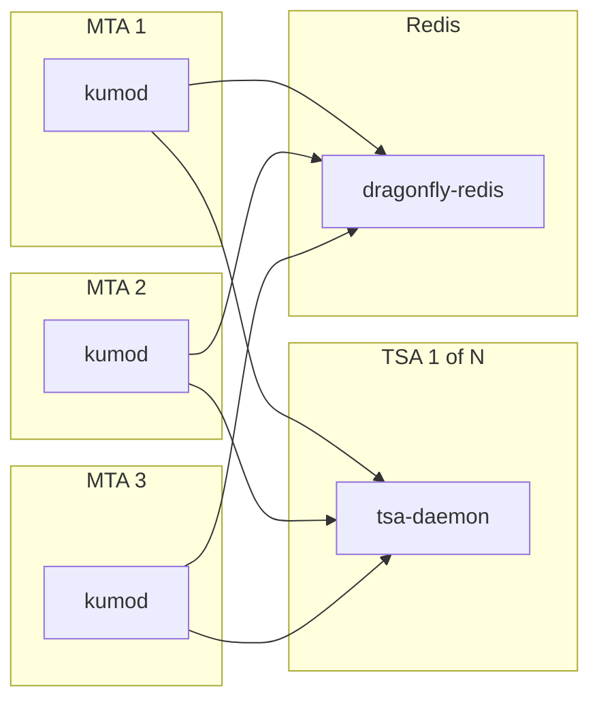

# kumomta-k8s-demo

KumoMTA is opensource software for running a large scale MTA. There are many
different ways to deploy Kumo, this demo focuses on running it in Kubernetes
using the this demo focuses on running it in Kubernetes following the ["Many
Nodes"
architecture](https://docs.kumomta.com/userguide/clustering/deployment/).



There are 4 high level pieces that make up a Kumo system.

- The MTA pods
- The TSA pods
- Redis
- The kumo proxy layer

The [Kumo proxy
layer](https://docs.kumomta.com/userguide/operation/kumo-proxy/?h=proxy),
responsible for public sending IP on the packets, is not included in this demo
setup. The networking paradigms of Kubernetes are not a good fit for this
component and implementation is left as an exercise for the reader.

## MTA (Mail Transfer Agent)

Mail transfer agent pods are responsible for receiving injected messages,
binding messages to the correct queues, and delivering message to the
destination mail server. A statefulset and persistent volume are used to ensure
the spool state for each pod persists outside of the individual pod's runtime.
It is possible to autoscale this layer based on a number of metrics such as
injection load.

## TSA (Traffic Shaping Automation)

The [TSA](https://docs.kumomta.com/userguide/configuration/trafficshaping/)
pods handle traffic shaping automation. Each MTA pod
requires a network connection to each replica of the TSA pods in order publish
updates. A statefulset provides a stable network identity for the TSA pods and
enables a static configuration of the hostnames, e.g.
`http://kumomta-tsa-0.kumomta-tsa-headless.default.svc.cluster.local:8008,
http://kumomta-tsa-1.kumomta-tsa-headless.default.svc.cluster.local:8008`. The
MTA pods can _read_ updates from any TSA pod, allowing a standard ClusterIP
service to be used, `http://kumomta-tsa.default.svc.cluster.local:8008`.

## Redis

Redis is used to share throttle state between Kumo pod replicas. This demo
makes use of [dragonflydb](https://www.dragonflydb.io/) for Redis since it supports the
[`CL_THROTTLE`](https://docs.kumomta.com/reference/kumo/configure_redis_throttles/) command used by Kumo and is easy
to deploy.

_NOTE: redis-cell and the CL_THROTTLE command are not required for Kumo, it will fall back to a lua implementation if the command is not available._

## How To Run This Demo

This demo requires 3 things to get started

- a Kubernetes cluster
- [helm](https://helm.sh/)
- [tilt](https://tilt.dev/)

I personally like to use [Rancher Desktop](https://rancherdesktop.io/) to
provide a container runtime and local Kubernetes cluster on macOS, but this
will also work with Docker Desktop, Orbstack, and others. Tilt makes it easy to
orchestrate the components locally and handle the install of dependencies like
dragonfly.

- checkout this repo
- run `tilt up` from the root of the repo
- cleanup by running `tilt down` when you are done

In the demo configuration, all mail is sent to a null sink pod that immediately drops the message upon receipt. You can test http injection with curl

```
curl -H "Content-Type: application/json" -u user1:dfad6143b4520f8526e4f9a0b25ab42b \
http://localhost:8000/api/inject/v1 \
-d @sample_http_inject_payload.json
```
